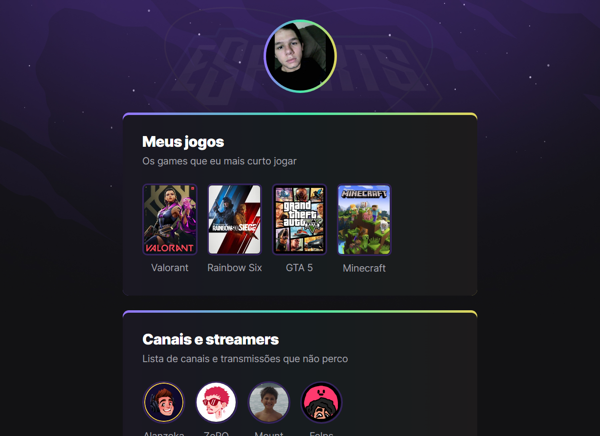

# NLW eSports 🎮

### ✏️ Descrição
Projeto construído no evento Next Level Week da Rocketseat
 
Exercício para aperfeiçoar minhas habilidades nas téncologias e para uso no futuro
 

O projeto é um agregador de links, uma página onde posso mostrar meus gostos de jogos, canais que assisto e que contêm minhas redes sociais.

[ Clique aqui para acessar](https://gustavofmiguel.github.io/NLW-eSpots-explorer/)
#
## 💻 Tecnologias utilizadas

 - HTML  
 - CSS  

## 📸 Demonstração

